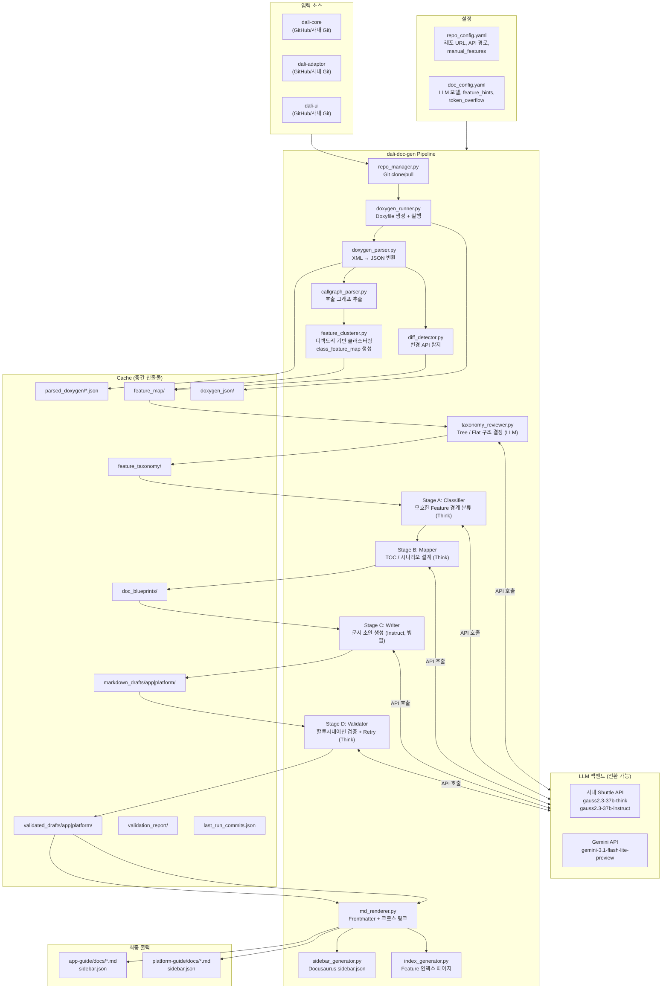
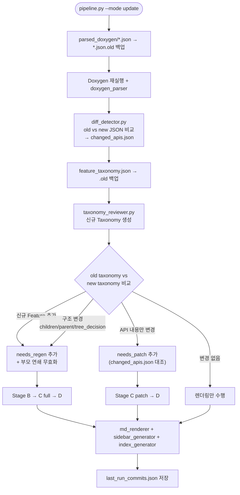
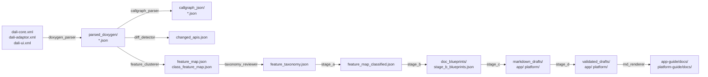
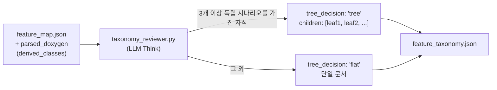
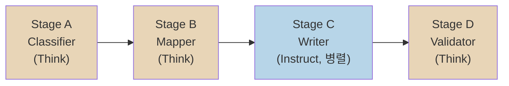
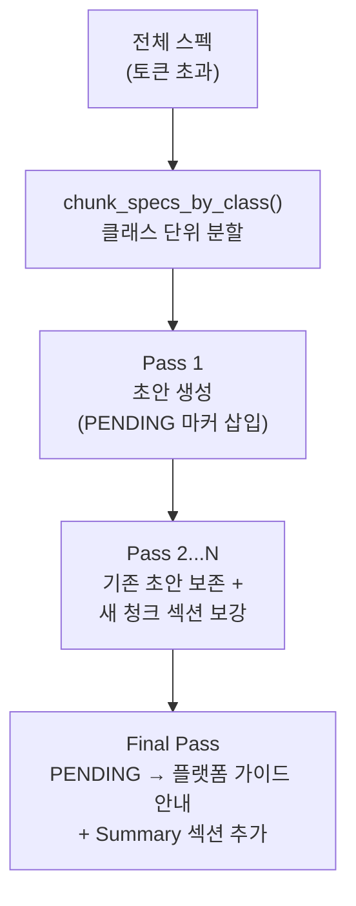
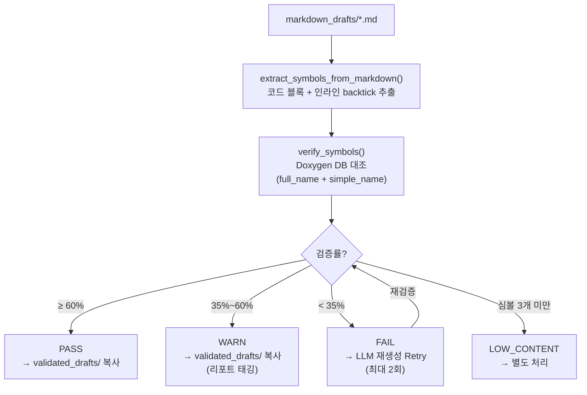
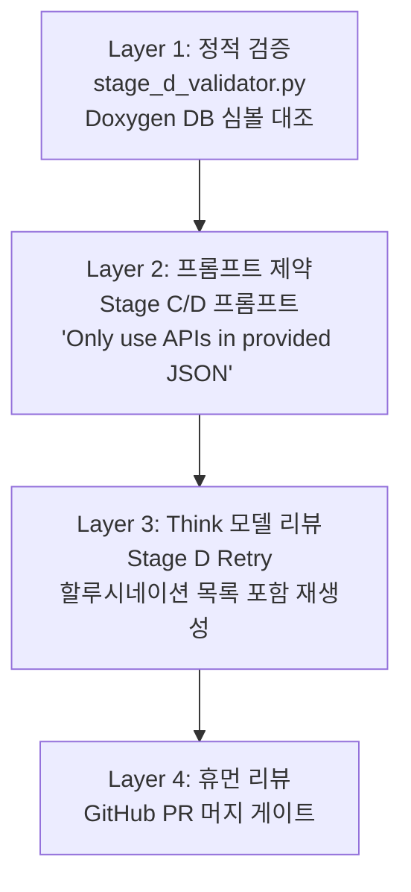
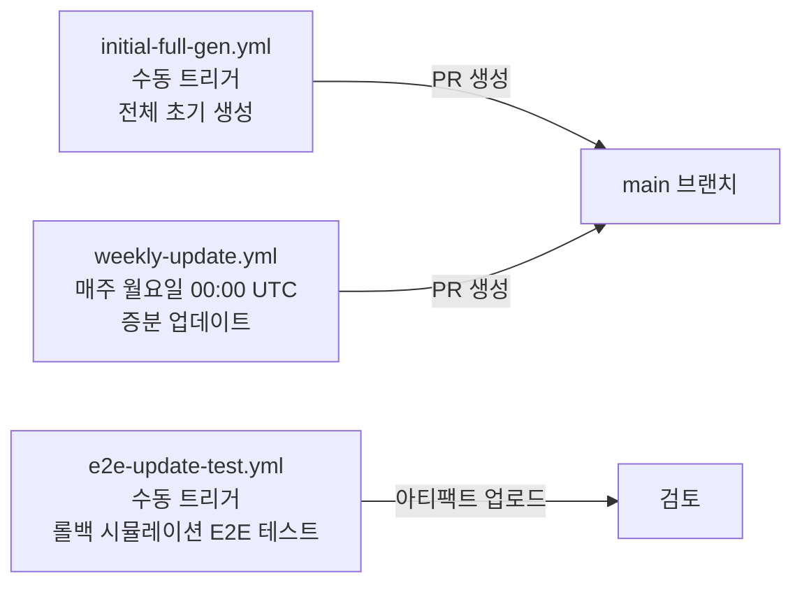

# DALi UI 가이드 문서 자동 생성 시스템 — 설계 문서 v1

> **작성 기준:** Phase 3 구현 완료 + Enhancing 1차 안정화 시점  
> **최종 커밋:** `164a7d7` Fix patch-mode and Stage D retry correctness issues

---

## 목차

1. [프로젝트 개요](#1-프로젝트-개요)
2. [요구사항](#2-요구사항)
3. [전체 시스템 구조](#3-전체-시스템-구조)
4. [파이프라인 실행 흐름](#4-파이프라인-실행-흐름)
5. [모듈별 상세 설명](#5-모듈별-상세-설명)
6. [LLM 운용 전략](#6-llm-운용-전략)
7. [핵심 설계 결정](#7-핵심-설계-결정)
8. [CI/CD 및 운영](#8-cicd-및-운영)
9. [현재 구현 상태](#9-현재-구현-상태)

---

## 1. 프로젝트 개요

DALi(Dynamic Animation Library) C++ 라이브러리를 분석하여, **앱 개발자** 및 **플랫폼 개발자**가 실제 업무에 활용할 수 있는 수준의 가이드 문서를 자동으로 생성·갱신하는 시스템이다.

Doxygen 정적 분석과 LLM(거대언어모델)을 다단계로 결합하여, 단순한 API 목록 나열이 아닌 **사용 시나리오와 코드 예제가 포함된 심층 가이드**를 생산한다. 생성된 문서는 Docusaurus 기반 사이트에 게재되며, MCP(Model Context Protocol) 서버를 통해 AI 어시스턴트에도 제공된다.

### 대상 라이브러리

| 패키지 | 역할 | 브랜치 |
|--------|------|--------|
| `dali-core` | 씬 그래프, 렌더링, 애니메이션 기반 엔진 | `tizen` / `master` |
| `dali-adaptor` | 플랫폼 연동 레이어 | `tizen` / `master` |
| `dali-ui` | 앱 개발자용 UI 컴포넌트 (View, Label 등) | `devel` |

### 문서 출력 타깃

| 출력 | 대상 독자 | API 범위 |
|------|-----------|----------|
| `app-guide/` | 앱 개발자 | `public-api` 전용 |
| `platform-guide/` | 플랫폼/엔진 개발자 | `public-api` + `devel-api` + `integration-api` |

---

## 2. 요구사항

### 2.1 기능 요구사항 (FR)

| ID | 요구사항 |
|----|----------|
| FR-01 | Doxygen XML과 C++ 소스를 분석하여 초기 문서를 자동 생성한다 |
| FR-02 | 주 1회 증분 업데이트로 API 변경 분만 재생성한다 |
| FR-03 | 독자 유형(앱/플랫폼)에 따라 다른 문서를 생산한다 |
| FR-04 | API를 기능 단위(Feature)로 자동 클러스터링한다 |
| FR-05 | Feature 간 상속 관계를 분석하여 Tree/Flat 문서 구조를 LLM이 결정한다 |
| FR-06 | `Dali::Ui::View`를 앱 개발의 1차 UI 객체로 명시한다 (Actor 직접 사용 지양) |
| FR-07 | 내부 LLM(사내 Shuttle API)과 외부 LLM(Gemini)을 설정 변경만으로 전환한다 |
| FR-08 | 4계층 할루시네이션 방어 파이프라인을 운영한다 |
| FR-09 | 구조 변경(Tree↔Flat) 감지 시 해당 Feature 전체를 자동 재생성한다 |
| FR-10 | API 변경만 감지된 경우 기존 문서를 최대 보존하며 패치 방식으로 업데이트한다 |

### 2.2 비기능 요구사항 (NFR)

| ID | 요구사항 |
|----|----------|
| NFR-01 | Doxygen XML 대비 LLM 입력 토큰을 60~70% 절감한다 |
| NFR-02 | CLI 및 GitHub Actions 양쪽에서 독립 실행 가능하다 |
| NFR-03 | Rate limit 초과 시 지수 백오프로 자동 재시도한다 |
| NFR-04 | 구조 변경 여부를 taxonomy JSON 비교로 판단하여 일관성 있게 무효화한다 |
| NFR-05 | 원본 C++ 소스 코드를 수정하지 않는다 |
| NFR-06 | 대형 Feature(스펙 2,000개 초과)는 롤링 정제로 컨텍스트 한도를 우회한다 |

---

## 3. 전체 시스템 구조

### 3.1 디렉토리 레이아웃

```
dali-ui-documentation/
├── dali-doc-gen/               # 파이프라인 본체
│   ├── config/
│   │   ├── repo_config.yaml    # 레포 URL, API 경로, manual_features
│   │   └── doc_config.yaml     # LLM 설정, feature_hints, token_overflow
│   ├── src/
│   │   ├── 00_extract/         # Phase 1: 정적 추출
│   │   ├── 01_cluster/         # Phase 1.5: Feature 클러스터링 & Taxonomy
│   │   ├── 02_llm/             # Phase 2: LLM 문서 생성 (Stage A~D)
│   │   ├── 03_render/          # Phase 3: 렌더링 & 사이드바
│   │   ├── pipeline.py         # 마스터 오케스트레이터
│   │   └── logger.py
│   ├── cache/                  # 런타임 중간 산출물
│   └── repos/                  # 클론된 DALi 레포지토리
├── app-guide/                  # 최종 출력: 앱 개발자 문서
├── platform-guide/             # 최종 출력: 플랫폼 개발자 문서
└── devel-note/                 # 설계·개발 노트
    └── Enhancing/              # 품질 강화 이력 (ENH-01~08 + CHECKPOINT)
```

### 3.2 컴포넌트 다이어그램



### 3.3 Update 모드 증분 처리 흐름



---

## 4. 파이프라인 실행 흐름

### 4.1 실행 모드 및 주요 플래그

```bash
# 전체 초기 생성
python src/pipeline.py --mode full --tier app

# 증분 업데이트
python src/pipeline.py --mode update --tier all

# 특정 Feature 타깃 (디버그)
python src/pipeline.py --mode full --tier app --features "view,label" --limit 2

# LLM 환경 일시 전환 (실행 완료 후 자동 복원)
python src/pipeline.py --mode update --tier app --llm external
```

| 플래그 | 설명 |
|--------|------|
| `--mode full\|update` | 전체 생성 또는 증분 업데이트 |
| `--tier app\|platform\|all` | 문서 독자 타깃 |
| `--features "a,b"` | 처리할 Feature 명시적 지정 |
| `--limit N` | 처리 Feature 수 제한 (테스트용) |
| `--skip-pull` | git pull 생략 (롤백 테스트용) |
| `--llm internal\|external` | LLM 환경 일시 오버라이드 |

### 4.2 캐시 아티팩트 흐름



---

## 5. 모듈별 상세 설명

### 5.1 Phase 1 — 정적 추출 (`00_extract/`)

#### `repo_manager.py`
DALi 레포지토리를 `repos/` 하위에 clone/pull. `repo_config.yaml`의 `internal_url` / `external_url`을 `llm_environment` 설정에 따라 선택.

#### `doxygen_runner.py`
패키지별 Doxyfile을 동적으로 생성하여 Doxygen을 실행. XML 출력과 콜 그래프(`CALL_GRAPH=YES`, `CALLER_GRAPH=YES`)를 함께 생성. 출력 위치: `cache/doxygen_json/`.

#### `doxygen_parser.py`
Doxygen XML을 파싱하여 LLM 전달용 경량 JSON으로 변환. 추출 필드: `name`, `kind`, `brief`, `api_tier`, `signature`, `params`, `returns`, `notes`, `warnings`, `code_examples`, `derived_classes`. 내부 ID·파일 오프셋 등 불필요 정보 제거로 **토큰 60~70% 절감**.

#### `diff_detector.py`
`parsed_doxygen/*.json.old` (이전 실행) vs `*.json` (현재 실행)을 compound·member 레벨로 비교. 변경 필드: `brief`, `signature`, `params`, `returns`, `notes`, `warnings`, `deprecated`, `since`. 결과: `cache/changed_apis.json`.

#### `callgraph_parser.py`
Doxygen XML의 콜 그래프 정보를 Python에서 처리하여 `callgraph_json/`에 저장. LLM에 직접 전달하지 않아 토큰 절약.

---

### 5.2 Phase 1.5 — Feature 클러스터링 & Taxonomy (`01_cluster/`)

#### `feature_clusterer.py`

헤더 파일의 API 디렉토리 경로를 기준으로 Feature를 자동 분류.

```
dali/public-api/actors/actor.h  →  feature: "actors"
dali-ui-foundation/public-api/label.h  →  feature: "label"  (tier 루트 파일 지원)
```

`repo_config.yaml`의 `manual_features`를 통해 디렉토리 구조와 무관하게 Feature를 강제 정의할 수 있다 (예: `view`, `actors` suppress, `custom-actor` suppress).

출력:
- `feature_map.json` — Feature별 클러스터 정보
- `class_feature_map.json` — 클래스명 → Feature 단독 매핑 (Spec 오염 방지)

스펙 수가 `max_specs_per_feature`(기본 2,000)를 초과하면 네임스페이스 기반 서브그룹 후보를 계산하여 `oversized` 마킹.

#### `taxonomy_reviewer.py`

LLM(Think 모델)이 각 Feature의 상속 관계를 분석하여 문서 구조를 결정.



`sanitize_children()` 후처리로 LLM이 반환한 children에서 자기 참조 및 중복을 제거. 빈 children은 자동으로 `flat`으로 다운그레이드.

---

### 5.3 Phase 2 — LLM 문서 생성 (`02_llm/`)

#### LLM Stage 개요



| Stage | 모델 | 입력 | 출력 | 실행 빈도 |
|-------|------|------|------|-----------|
| A | Think | feature_map.json | feature_map_classified.json (audience, tier 판정) | Full 시 1회 |
| B | Think | classified_map + Doxygen 샘플 | stage_b_blueprints.json (TOC + 시나리오 2~3개) | 신규 Feature만 |
| C | Instruct | blueprints + Doxygen 스펙 | markdown_drafts/app\|platform/*.md | 변경 Feature만 (병렬) |
| D | Think | markdown_drafts + Doxygen DB | validated_drafts + validation_report | 변경 Feature만 |

#### `stage_a_classifier.py`

모호한 Feature(여러 패키지에 걸쳐 있거나 audience가 불분명한 것)만을 LLM에 전달하여 `audience`(app/platform)와 `tier`를 판정. 명확한 Feature는 LLM 호출 없이 통과.

#### `stage_b_mapper.py`

Think 모델이 Feature의 TOC(목차)와 사용 시나리오(2~3개)를 설계. Blueprint는 Stage C의 작성 가이드라인이자 Stage D Retry의 재생성 기준으로도 활용된다.

API 샘플링(`sample_apis()`)으로 대형 Feature의 Stage B 토큰 사용량을 통제. 클래스 선언을 우선하고 메서드는 균등 간격으로 샘플링.

#### `stage_c_writer.py`

핵심 문서 생성 모듈. 주요 기능:

**Tier-aware 생성**
```python
allowed_tiers = {"public-api"} if args.tier == "app" else None
tier_drafts_dir = OUT_DRAFTS_DIR / args.tier  # app/ 또는 platform/
```

**토큰 오버플로우 대응 — 롤링 정제(Rolling Refinement)**

스펙 토큰 추정치가 `spec_token_threshold`(기본 60,000)를 초과하면 다음 방식으로 처리:
1. 클래스 단위로 청크 분할 (`chunk_specs_by_class()`)
2. Pass 1: 첫 번째 청크로 초안 생성 (미처리 섹션에 `<!-- PENDING -->` 마커)
3. Pass N: 기존 초안 보존 + 다음 청크 내용으로 보강
4. 최종 Pass: 모든 PENDING 마커를 platform guide 안내 문구로 대체



**Fluent API 감지**
반환 타입이 참조(`&`)이고 const가 아닌 메서드에 `chainable: true` 플래그를 설정. 플래그가 있는 Feature는 메서드 체이닝 스타일 예제 코드를 권장하는 프롬프트 블록을 주입.

**feature_hints 주입**
`doc_config.yaml`에 Feature별 추가 컨텍스트를 정의할 수 있다:
```yaml
feature_hints:
  view:
    extra_context: |
      View supports Fluent API through method chaining...
```

**suppress_doc / merge_into 처리**
- `suppress_doc: true` Feature는 스킵 (예: `actors`, `custom-actor`)
- `merge_into: "view"` Feature는 대상 Feature의 "Inherited API Context"로 통합

**patch 모드**
기존 `validated_drafts/{tier}/{feat}.md`를 불러와 변경된 API 부분만 수술적으로 업데이트. changelog 섹션 생성을 명시적으로 금지.

#### `stage_d_validator.py`

**심볼 검증 흐름**



Retry 시에는 `blueprint_with_tier["allowed_tiers"]`를 통해 tier 필터를 유지하여 app-guide 재생성 시 devel-api 스펙이 포함되지 않도록 보장.

#### `llm_client.py`

- `TokenRateLimiter`: 슬라이딩 윈도우 기반 분당 토큰 제한 (Gemini Free Tier: 250,000 tok/min)
- 지수 백오프 재시도 (최대 10회)
- 사내 Shuttle API: Basic Auth (`ACCESS_KEY:SECRET_KEY` Base64)
- 외부 Gemini API: API Key 인증
- `use_think=True/False`로 Think/Instruct 모델 전환

---

### 5.4 Phase 3 — 렌더링 (`03_render/`)

#### `md_renderer.py`

Jinja2 템플릿으로 Frontmatter 주입:
```yaml
---
id: view
title: "View (Base UI Object)"
sidebar_label: "View (Base UI Object)"
---
```

taxonomy의 `display_name`을 기준으로 본문 내 Feature 이름을 자동으로 상호 링크로 변환.

#### `sidebar_generator.py`

taxonomy의 tree/flat 결정에 따라 Docusaurus v3 호환 `sidebar.json`을 생성. Tree 구조 Feature는 Category + Children 형태로 중첩.

#### `index_generator.py`

모든 Feature를 나열하는 인덱스 페이지를 자동 생성.

---

### 5.5 할루시네이션 방어 4계층



---

## 6. LLM 운용 전략

### 6.1 내부/외부 LLM 전환

`doc_config.yaml`의 `llm_environment` 값 하나로 전환:

| 항목 | 내부 (Shuttle) | 외부 (Gemini) |
|------|---------------|---------------|
| Think 모델 | `gauss2.3-37b-think` | `gemini-3.1-flash-lite-preview` |
| Instruct 모델 | `gauss2.3-37b` | `gemini-3.1-flash-lite-preview` |
| 인증 | Basic Auth (Base64) | API Key |
| Rate Limit 대기 | 4초/요청 (20 RPM) | 슬라이딩 윈도우 250k tok/min |
| 재시도 횟수 | 최대 10회 | 최대 10회 |

### 6.2 토큰 최적화 전략

| 전략 | 절감 효과 |
|------|----------|
| Doxygen XML → 경량 JSON 필터링 | 60~70% 절감 |
| 콜 그래프 Python 처리 (LLM 미전달) | 대형 Feature 수천 토큰 절약 |
| Feature 단위 분할 생성 | 20만 토큰 단일 프롬프트 방지 |
| Stage B 샘플링 (클래스+메서드 50개) | B 단계 입력 토큰 최소화 |
| 증분 업데이트 (변경 Feature만 처리) | 업데이트 시 전체의 O(M) 호출, M ≪ N |
| Stage B: 신규 Feature만 재실행 | 전체 배포 시 Think 호출 ~1회 |
| 롤링 정제 (대형 Feature 분할 처리) | 컨텍스트 한도 우회 |

---

## 7. 핵심 설계 결정

### D-1. Feature Taxonomy: Tree vs Flat

단순 상속 관계가 항상 별도 문서를 정당화하지는 않는다. LLM이 "자식 컴포넌트 각각이 3개 이상의 독립 사용 시나리오를 가지는가"를 판단하여 Tree/Flat을 결정.

- **Tree**: 부모 페이지(개요) + 자식 페이지(세부) 구조
- **Flat**: 단일 문서에 모든 내용 포함

예: `ImageView` → Tree (`AnimatedImageView`, `LottieAnimationView` 자식)

### D-2. class_feature_map: Spec 오염 방지

동일한 클래스(`SpringData` 등)가 여러 Feature 문서에 중복 등장하는 문제를 방지. Feature Clusterer가 클래스 단독 귀속 매핑 파일을 생성하며, Stage C가 이를 참조하여 "다른 Feature 소속" 클래스는 foreign으로 제외.

```
class_feature_map.json: { "Dali::SpringData": "animation", "Dali::Ui::Label": "label", ... }
```

### D-3. API 변경 감지: 파일 레벨이 아닌 JSON 비교

초기 설계(CP-001)에서는 git diff 파일 레벨로 변경을 감지했으나, 라이선스 헤더나 `#include` 변경도 감지되는 문제가 있었다. 현재는 `parsed_doxygen/*.json.old` ↔ `*.json` 비교로 실제 API 내용(signature, brief, params 등) 변경만 추적.

### D-4. Tier 분리: 생성 시점에서 적용

"앱 가이드에서 devel-api 내용 제거"는 사후 필터링이 불가능하다. Stage B와 Stage C가 tier에 맞는 스펙만 수신하도록 `allowed_tiers` 파라미터를 전달하여 생성 시점에 격리.

### D-5. manual_features: 도메인 의도 명시

디렉토리 구조만으로는 캡처할 수 없는 도메인 지식을 `repo_config.yaml`에 주입:
- `view`: DALi 앱 개발의 1차 UI 객체로 강제 정의
- `actors`: `suppress_doc: true`, `merge_into: "view"` — Actor 스펙을 View 문서에 통합
- `custom-actor`: `suppress_doc: true` — 내부 확장 메커니즘, 문서화 대상 아님

---

## 8. CI/CD 및 운영

### 8.1 GitHub Actions 워크플로우



| 워크플로우 | 트리거 | Runner | 출력 |
|------------|--------|--------|------|
| `initial-full-gen.yml` | 수동 (`workflow_dispatch`) | code-large | `docs/initial-full-{tier}` PR |
| `weekly-update.yml` | Cron `0 0 * * 1` + 수동 | code-large | `docs/weekly-update` PR |
| `e2e-update-test.yml` | 수동 | code-large | 비교 아티팩트 업로드 |

### 8.2 E2E 테스트 시나리오

1. 대상 레포를 `HEAD~N` (기본 30커밋)으로 롤백
2. `--mode full --skip-pull`로 과거 시점 문서 생성
3. 레포를 최신으로 복원
4. `--mode update`로 증분 업데이트 실행
5. 두 결과를 아티팩트로 업로드하여 비교

### 8.3 운영 체크리스트

- GitHub Secrets: `GEMINI_API_KEY`, `INTERNAL_API_KEY`, `GITHUB_TOKEN`
- GitHub Variables: `DEFAULT_ENVIRONMENT` (scheduled 실행의 LLM 환경 기본값)
- Runner: `code-large` (self-hosted, 내부 LLM 사용 시 필요)
- 의존: Python 3.12+, Doxygen (apt 설치)

---

## 9. 현재 구현 상태

### 9.1 Phase별 완료 현황

| Phase | 내용 | 상태 |
|-------|------|------|
| Phase 0 | 환경 구축, Doxygen 검증, LLM API 테스트 | ✅ 완료 |
| Phase 1 | repo_manager, doxygen_parser, callgraph_parser, diff_detector, feature_clusterer | ✅ 완료 |
| Phase 1.5 | taxonomy_reviewer (Tree/Flat LLM 결정) | ✅ 완료 |
| Phase 2 | Stage A/B/C/D (프롬프트 엔지니어링 포함) | ✅ 완료 |
| Phase 3 | md_renderer, sidebar_generator, index_generator, GitHub Actions | ✅ 완료 |
| Phase 4 | E2E 테스트, 품질 메트릭, 프롬프트 튜닝 | 🔶 진행 중 |
| Phase 5 | 전체 생성, Docusaurus 배포, MCP 연동 | 📋 예정 |

### 9.2 Enhancing 작업 이력

| 번호 | 내용 | 상태 |
|------|------|------|
| ENH-01 | Feature 경계 정확도 — `class_feature_map`, `suppress_doc`, `merge_into` | ✅ 완료 |
| ENH-02 | Doxygen 컨텍스트 강화 — params/returns/notes/warnings/code_examples | ✅ 완료 |
| ENH-03 | Fluent API 체이닝 감지 및 프롬프트 주입 | ✅ 완료 |
| ENH-04 | 대형 Feature 토큰 오버플로우 — 롤링 정제 + 자동 분할 | ✅ 완료 |
| ENH-05 | `.notier` 버그 수정 — tier 루트 파일 미분류 문제 | ✅ 완료 |
| ENH-06 | 마크다운 품질 개선 FIX-0~5 | 🔶 FIX-0/1 완료, FIX-2~5 미완료 |
| ENH-07 | Update 모드 버그 5종 수정 | ✅ 완료 |
| ENH-08 | Phase 4 증분 업데이트 엔진 (taxonomy JSON diff) | ✅ 완료 |

### 9.3 잔여 수정 항목 (ENH-06 FIX-2~5)

| ID | 항목 | 대상 파일 |
|----|------|-----------|
| FIX-3 | Stage B 프롬프트에 범위 집중 규칙 추가 | `stage_b_mapper.py` |
| FIX-4 | API 사용 설명 가이드라인 강화 | `stage_c_writer.py` |
| FIX-5 | 서브섹션 심도 개선 (예제 코드, 단계별 설명) | `stage_c_writer.py` |

### 9.4 기술 스택 요약

| 레이어 | 기술 |
|--------|------|
| 언어 | Python 3.12+ |
| C++ 파싱 | Doxygen (XML + Call Graph) |
| LLM API | OpenAI-compatible REST (사내 Shuttle / Gemini) |
| 비동기 | asyncio + aiohttp |
| 설정 관리 | PyYAML, Pydantic |
| VCS 연동 | GitPython |
| 템플릿 | Jinja2 |
| 테스트 | pytest, pytest-asyncio |
| CI/CD | GitHub Actions (self-hosted + cloud runner) |
| 문서 게재 | Docusaurus v3 |
